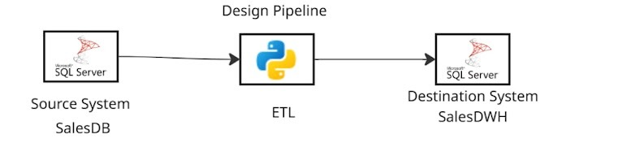
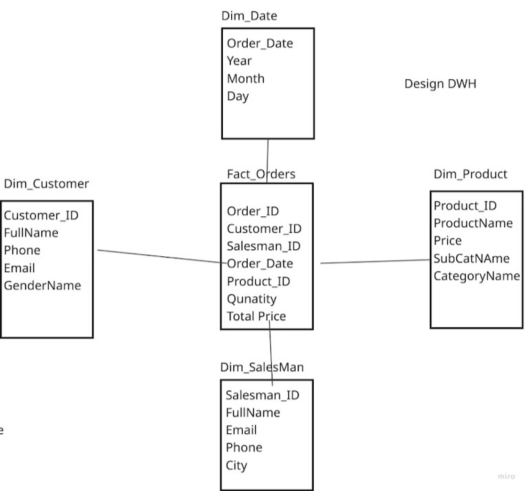
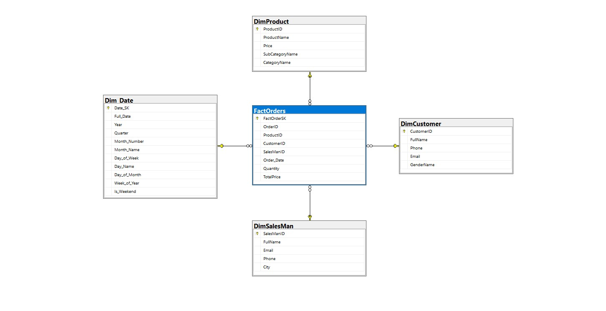
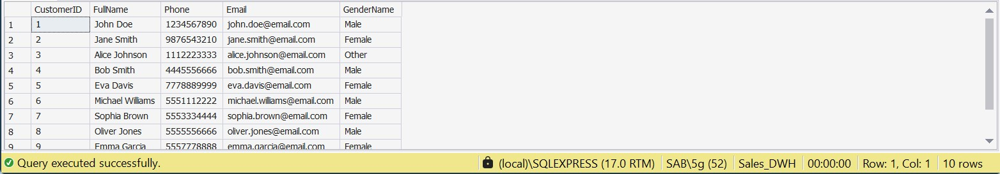
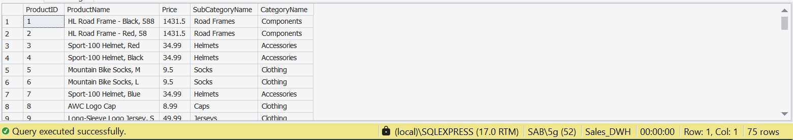
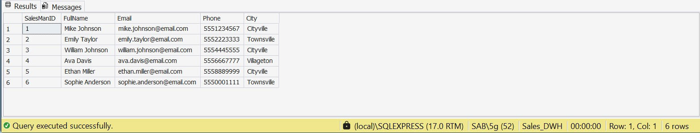
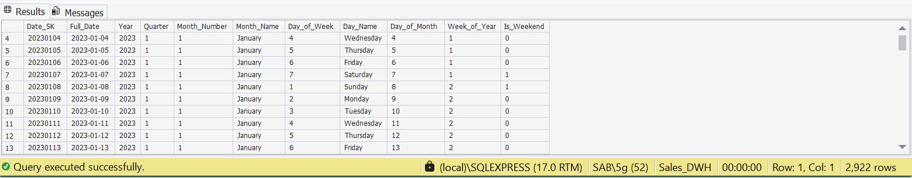
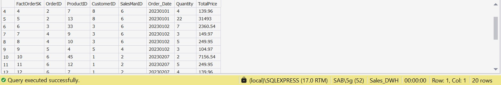

# 🏪 Sales Data Mart — End-to-End Data Warehouse Project

> A complete Data Warehousing project built during the **DEPI Internship Program**, covering pipeline design, star schema modeling, ETL implementation, and dimensional data loading using Python and SQL Server.

---

## Project Overview

This project implements a **Sales Data Mart** based on a transactional OLTP system (`Sales_OLTP`). The goal is to transform raw operational data into an analytics-ready **Star Schema** data warehouse (`Sales_DWH`) that enables efficient reporting and business intelligence.

**Source System (Sales_OLTP)** contains:
- Categories & SubCategories
- Products
- Customers (with gender info)
- Salesmen & Addresses
- Orders & Order Details

**Target System (Sales_DWH)** is a Star Schema with:
- `DimCustomer` — customer demographics
- `DimProduct` — product hierarchy
- `DimSalesMan` — salesperson details
- `Dim_Date` — date dimension (2023–2030)
- `FactOrders` — sales transactions (measures: Quantity, TotalPrice)

---

## Tech Stack

| Tool | Purpose |
|---|---|
| **SQL Server Express** | Source OLTP & Target DWH |
| **Python 3** | ETL scripting |
| **pandas** | Data extraction & transformation |
| **pyodbc** | Database connectivity |
| **Jupyter Notebook** | ETL development & documentation |
| **Excel** | Source-to-target mapping sheet |

---

## Project Steps

### Step 1 — Pipeline Design

The ETL pipeline follows a classic **Extract → Transform → Load** architecture:

```
 ┌─────────────────┐     Extract      ┌───────────────────┐     Load     ┌──────────────────┐
 │   Sales_OLTP    │ ───────────────► │    DWH / OLAP     │ ───────────► │   Sales_DWH      │
 │  (SQL Server)   │                  │       ETL         │              │  (SQL Server)    │
 └─────────────────┘                  └───────────────────┘              └──────────────────┘
```

**Extract:** SQL views (`prod_view`, `salesman_view`, `order_view`) are used to pre-join and flatten the OLTP tables before pulling data into Python DataFrames.

**Transform:** Data cleaning steps applied per entity:
- Customers: full name concatenation, phone number dash removal, null checks
- Products: multi-level join (SubCategory → Category)
- SalesMan: address join for city field
- FactOrders: `OrderDate` converted from datetime to integer key (`YYYYMMDD`), Quantity cast to `float64`

**Load:** Row-by-row insert into each DWH dimension/fact table via `pyodbc` cursor execution.

> 📸 *Add your pipeline diagram image here:*
> 

---

### Step 2 — DWH Schema Design

The data warehouse follows a **Star Schema** with one central fact table surrounded by four dimension tables.

```
                    ┌─────────────────┐
                    │   DimCustomer   │
                    │─────────────────│
                    │ CustomerID (PK) │
                    │ FullName        │
                    │ Phone           │
                    │ Email           │
                    │ GenderName      │
                    └────────┬────────┘
                             │
┌──────────────┐    ┌────────▼────────────┐    ┌─────────────────┐
│  DimProduct  │    │     FactOrders      │    │  DimSalesMan    │
│──────────────│    │─────────────────────│    │─────────────────│
│ ProductID PK │◄───│ FactOrderSK (PK)    │───►│ SalesManID (PK) │
│ ProductName  │    │ OrderID             │    │ FullName        │
│ Price        │    │ ProductID (FK)      │    │ Email           │
│ SubCategory  │    │ CustomerID (FK)     │    │ Phone           │
│ CategoryName │    │ SalesManID (FK)     │    │ City            │
└──────────────┘    │ Order_Date (FK)     │    └─────────────────┘
                    │ Quantity            │
                    │ TotalPrice          │    ┌─────────────────┐
                    └────────┬────────────┘    │    Dim_Date     │
                             │                 │─────────────────│
                             └────────────────►│ Date_SK (PK)    │
                                               │ Full_Date       │
                                               │ Year / Quarter  │
                                               │ Month / Day     │
                                               │ Is_Weekend      │
                                               └─────────────────┘
```

> 📸 *Add your schema diagram screenshot here:*
> 

---

### Step 3 — Data Mapping

The mapping document (`Maping.xlsx`) defines the full **source-to-target column lineage** for each dimension and the fact table.

| Target Table | Target Column | Source Table(s) | Source Column | Transformation |
|---|---|---|---|---|
| DimCustomer | CustomerID | Customer | CustomerID | Direct |
| DimCustomer | FullName | Customer | FirstName, LastName | `CONCAT(FirstName, ' ', LastName)` |
| DimCustomer | Phone | Customer | PhoneNumber | Remove dashes |
| DimCustomer | Email | Customer | Email | Direct |
| DimCustomer | GenderName | Gender | GenderName | Left Join on GenderID |
| DimProduct | ProductID | Product | ProductID | Direct |
| DimProduct | ProductName | Product | ProductName | Direct |
| DimProduct | Price | Product | Price | Direct |
| DimProduct | SubCategoryName | SubCategory | SubCategoryName | Left Join on SubCategoryID |
| DimProduct | CategoryName | Category | CategoryName | Left Join on CategoryID |
| DimSalesMan | SalesManID | Salesman | SalesmanID | Direct |
| DimSalesMan | FullName | Salesman | FirstName, LastName | `CONCAT(FirstName, ' ', LastName)` |
| DimSalesMan | Phone | Salesman | PhoneNumber | Remove dashes |
| DimSalesMan | Email | Salesman | Email | Direct |
| DimSalesMan | City | Address | City | Left Join on AddressID |
| FactOrders | OrderID | Orders | OrderID | Direct |
| FactOrders | ProductID | OrderDetails | ProductID | FK Reference |
| FactOrders | CustomerID | Orders | CustomerID | FK Reference |
| FactOrders | SalesManID | Orders | SalesmanID | FK Reference |
| FactOrders | Order_Date | Orders | OrderDate | `strftime('%Y%m%d').astype(int)` |
| FactOrders | Quantity | OrderDetails | Quantity | Cast to float64 |
| FactOrders | TotalPrice | OrderDetails | TotalPrice | Direct |

> 📎 Full mapping file: [`Maping.xlsx`](Maping.xlsx)

---

### Step 4 — DDL Implementation

The DWH schema was implemented using SQL Server DDL statements. Key design decisions:

- `FactOrders` uses a **surrogate key** (`FactOrderSK IDENTITY`) since `OrderID` can repeat across order lines
- `Order_Date` in FactOrders is an `INT` foreign key referencing `Dim_Date.Date_SK` (format: `YYYYMMDD`)
- `Dim_Date` is pre-populated from **2023 to 2030** using a stored procedure `sp_PopulateDateDimension`
- All dimension tables use the natural business key as the primary key

**Files:**
- [`sales_dwh_query.sql`](sales_dwh_query.sql) — Full DDL for all tables + stored procedure
- [`etl_queries.sql`](etl_queries.sql) — OLTP source views used in extraction

> 📸 *Add your SQL Server database diagram screenshot here:*
> 

> 📸 *Add screenshots of each populated DWH table here:*
> 
> 
> 
> 
> 

---

### Step 5 — ETL Using Python

The ETL process is implemented in a **Jupyter Notebook** (`etl_dwh.ipynb`) with three clearly separated stages:

#### Extract

```python
import pyodbc
import pandas as pd

source_conn = pyodbc.connect(
    "DRIVER={ODBC Driver 17 for SQL Server};"
    "SERVER=.\SQLEXPRESS;"
    "DATABASE=Sales_OLTP;"
    "Trusted_Connection=yes;"
)

customer_df  = pd.read_sql("SELECT CustomerID, CONCAT(FirstName,' ',LastName) AS FullName, ...", source_conn)
product_df   = pd.read_sql("SELECT ProductID, ProductName, Price, SubCategoryName, CategoryName ...", source_conn)
salesman_df  = pd.read_sql("SELECT * FROM salesman_view", source_conn)
factorders_df = pd.read_sql("SELECT * FROM order_view", source_conn)
```

#### Transform

```python
# Clean phone numbers
customer_df['Phone']  = customer_df['Phone'].replace('-', '')
salesman_df['Phone']  = salesman_df['Phone'].replace('-', '')

# Convert OrderDate to integer date key (YYYYMMDD)
factorders_df['Order_Date'] = factorders_df['Order_Date'].dt.strftime('%Y%m%d').astype(int)

# Cast Quantity to float64
factorders_df['Quantity'] = factorders_df['Quantity'].astype('float64')
```

#### Load

```python
destination_conn = pyodbc.connect(
    "DRIVER={ODBC Driver 17 for SQL Server};"
    "SERVER=.\SQLEXPRESS;"
    "DATABASE=Sales_DWH;"
    "Trusted_Connection=yes;"
)

# Example: Load DimCustomer
for index, row in customer_df.iterrows():
    cursor.execute(
        "INSERT INTO DimCustomer (CustomerID, FullName, Phone, Email, GenderName) VALUES (?, ?, ?, ?, ?)",
        row['CustomerID'], row['FullName'], row['Phone'], row['Email'], row['GenderName']
    )
    destination_conn.commit()
```

> 📓 Full notebook: [`etl_dwh.ipynb`](etl_dwh.ipynb)

---

## Repository Structure

```
Sales-Data-Mart/
│
├── README.md                  # This file
├── etl_dwh.ipynb              # ETL pipeline (Extract, Transform, Load)
├── sales_dwh_query.sql        # DWH DDL — tables, stored procedure, date dimension
├── etl_queries.sql            # OLTP source views for extraction
├── Maping.xlsx                # Source-to-target mapping sheet
│
└── images/                    # Screenshots (add yours here)
    ├── pipeline_design.png
    ├── dwh_schema.png
    ├── db_diagram.png
    ├── dim_customer.png
    ├── dim_product.png
    ├── dim_salesman.png
    ├── dim_date.png
    └── fact_orders.png
```

---

## How to Run

**Prerequisites:**
- SQL Server Express with ODBC Driver 17
- Python 3.x
- Jupyter Notebook
- `pip install pyodbc pandas`

**Steps:**

1. **Restore OLTP database** — Restore `Sales_OLTP.back` into SQL Server
2. **Create DWH** — Run `sales_dwh_query.sql` to create `Sales_DWH` with all tables and the date dimension
3. **Create source views** — Run `etl_queries.sql` on `Sales_OLTP` to create the extraction views
4. **Run ETL** — Open and execute `etl_dwh.ipynb` in Jupyter Notebook

---

## Author

**ESAB**
DEPI Internship Program — Data Engineering Track
📅 April 2026

---

> ⭐ If you found this project useful, feel free to star the repository!
